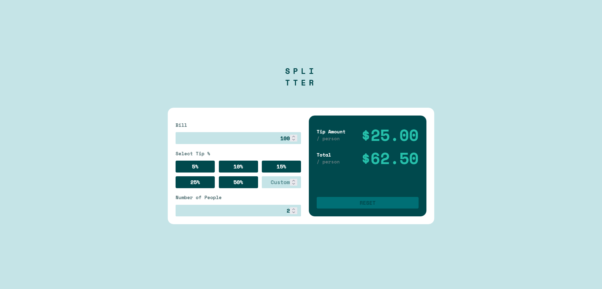

# Frontend Mentor - Tip calculator using React

## Overview

### Screenshot

### Links

-   Solution URL: https://tip-calculator-react-gamma.vercel.app/

## My process

### Built with

-   Semantic HTML5 markup
-   CSS custom properties
-   Flexbox
-   Grid
-   Media Queries
-   JavaScript
-   React

### What I learned

In this project i could use React JS to build a simple tip calculator, with the possibility to calculate a tip according to the percentages in the buttons, or to insert a custom percentage.

## Author

-   GitHub - Vinícius dos Santos Verissimo (https://github.com/viniciusdsv93)
